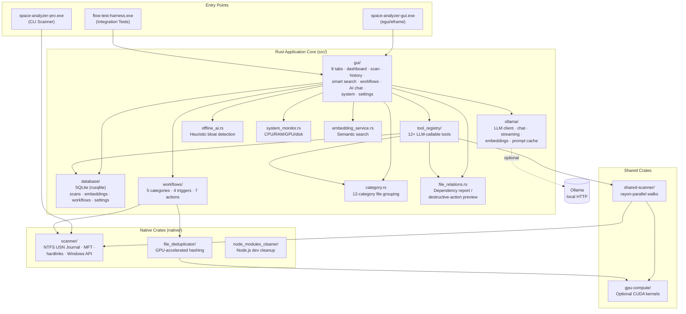

> **For AI agents:** Primary issue tracker is **`docs/issues.json`** (schema v1).
> Quick reference: **`docs/ISSUES.md`** (~80 lines, token-efficient). Do not use `docs/CONSOLIDATED_ISSUE_TRACKER.csv` as source of truth.
> Update workflow: find by `id:MAIN-XXX` tag in `tags[]` → fix code → update status in `issues.json` → `python docs/export_issues_to_csv.py`
<p align="center">
  
</p>

<p align="center">
  <a href="https://github.com/ogneocortext/space-analyzer-pro/releases/latest"></a>
  <a href="https://github.com/ogneocortext/space-analyzer-pro/blob/main/LICENSE"></a>
  <a href="https://github.com/ogneocortext/space-analyzer-pro/stargazers"></a>
</p>

<p align="center">
  <a href="#why-space-analyzer-pro">Why?</a> &nbsp;·&nbsp;
  <a href="#quick-start">Quick Start</a> &nbsp;·&nbsp;
  <a href="#features">Features</a> &nbsp;·&nbsp;
  <a href="#architecture">Architecture</a> &nbsp;·&nbsp;
  <a href="#screenshots">Screenshots</a> &nbsp;·&nbsp;
  <a href="#development">Development</a> &nbsp;·&nbsp;
  <a href="#documentation">Docs</a>
</p>

---

## Why Space Analyzer Pro?

Unlike web-based space analyzers, Space Analyzer Pro runs as a **native Windows binary** with direct filesystem access, embedded SQLite, optional GPU acceleration, and an optional local LLM (Ollama) — all without spinning up servers, exposing ports, or sending data off-device.

| What you get | What you don't |
|---|---|
| Single ~16 MB binary | No Node.js, no Python server, no Docker |
| Embedded SQLite database | No PostgreSQL, no Redis, no cloud DB |
| Optional local Ollama AI | No OpenAI API, no telemetry, no tracking |
| Optional NVIDIA GPU accel | No vendor lock-in, CPU fallback works fine |
| Recursive multi-volume scan | No browser limitations, no upload size limits |
| Hardlink-based dedup | No re-encoding, no data loss |

---

## Quick Start

```bash
# Build the GUI
cargo build --release --bin space-analyzer-gui
./target/release/space-analyzer-gui.exe

# Or use the task runner
just run-gui
```

### Prerequisites

| Requirement | Required? | Notes |
|---|---|---|
| **Rust 1.95+** | ✅ Yes | [rustup.rs](https://rustup.rs) |
| **Windows 10/11 x64** | ✅ Yes | Uses Win32 APIs in `native/scanner/` |
| **NVIDIA GPU** | ⚠️ Optional | For GPU-accelerated dedup; CPU fallback works |
| **Ollama** | ⚠️ Optional | For AI Assistant and Smart Search tabs |

### Command Line Interface

```bash
# Basic scan
cargo run --bin space-analyzer-pro -- --path . --verbose

# Export results to JSON
cargo run --bin space-analyzer-pro -- --path . --export results.json

# Deep scan with extended metadata
cargo run --bin space-analyzer-pro -- --path . --deep

# Filter by file type
cargo run --bin space-analyzer-pro -- --path . --type "Documents" "Images"
```

---

## Features

### Core Scanning
- **Recursive directory scanning** with real-time progress, cancellation, and performance metrics
- **Multi-volume disk support** (3+ drives) with usage gauges
- **NTFS USN Journal scanner** for incremental change tracking
- **Hard-link detection** via MFT parsing
- **Scan history** with comparison, filtering, and SQLite-backed persistence

### Analysis
- **File categorization** into 12 human-readable groups (Documents, Images, Videos, Audio, Archives, Code, Development, Config, Logs, Backups, Database, Other) — [`src/category.rs`](src/category.rs)
- **Bloat detection** via heuristic pattern classifier (large videos, cache files, build artifacts, dev dependencies) — [`src/offline_ai.rs`](src/offline_ai.rs)
- **Storage trend prediction** based on historical scan data
- **AI recommendations** for cleanup, organization, and optimization
- **Largest files & directories** ranking

### File Management
- **Duplicate finder** with parallel hashing and **optional GPU acceleration**
- **Hard-link deduplication** to reclaim space without re-encoding
- **Destructive-action preview** — `DependencyReport` shows related files (hardlinks, symlinks, siblings, paired extensions) before deletion — [`src/file_relations.rs`](src/file_relations.rs)
- **Export** to JSON, CSV, HTML, and PDF

### AI Integration (Optional)
- **Ollama-powered AI Assistant** with chat, streaming, and tool-calling
- **Smart Search** using semantic embeddings for natural-language file queries
- **12+ tool registry** exposing scan/history/volumes/resources/storage_trend/workflows/file_type_breakdown/predict/patterns/search/largest_files/dependencies to the LLM
- **100% local** — no cloud APIs, no telemetry

### Workflow Automation
- **5 workflow categories**: Maintenance, Optimization, Organization, Monitoring, Custom
- **4 trigger types**: Manual, LowDiskSpace, FileSystemChange, OnStartup
- **7 action types**: Scan, FindDuplicates, PredictStorage, GenerateRecommendations, Export, Notify, AIAnalyze
- **Pre-configured templates** for common cleanup tasks
- **Execution history** with status tracking and cancellation

### System Monitoring
- **CPU, RAM, GPU, and disk** real-time gauges
- **Per-volume usage** with free/total breakdowns
- **Storage trend** line chart (when ≥2 scans in history)
- **Background refresh** without UI blocking

---

## Architecture

<details>
<summary><b>Click to expand full architecture diagram</b></summary>



</details>

### Tabs

| Tab | Purpose |
|-----|---------|
| **Dashboard** | Hero stats, file categories, bloat candidates, disk volumes, system resources, storage trend, AI recommendations |
| **Scan** | Configure paths, run scans, watch progress, view results |
| **History** | Browse past scans, compare, delete, export |
| **Smart Search** | Semantic search via local embeddings (requires Ollama) |
| **Workflows** | Create, edit, schedule, and run automated cleanup/analysis workflows |
| **AI Assistant** | Chat with local LLM; the LLM can call tools to scan, analyze, and act on your behalf |
| **System** | CPU/RAM/GPU/disk monitor with real-time gauges |
| **Settings** | Configure Ollama endpoint, default scan paths, theme, GPU toggle |

### Stack

| Component | Implementation | Notes |
|---|---|---|
| **GUI** | egui/eframe 0.34 (native Rust) | Single window, 8 tabs |
| **Database** | SQLite via `rusqlite` (bundled) | No external DB server |
| **File Scanner** | `shared-scanner` (rayon-parallel) | CPU mode default |
| **GPU Acceleration** | `gpu-compute` crate (optional) | Auto-detects NVIDIA, falls back to CPU |
| **AI Backend** | Ollama (HTTP, local-only) | Off by default; opt-in via Settings |
| **Workflow Engine** | `src/workflows/` | Native Rust, no external scheduler |
| **System Monitor** | `sysinfo` crate | Cross-platform base + Windows-specific NTFS APIs |

---

## Screenshots

> Screenshots below are from the actual Rust desktop GUI (egui). For more, see [`assets/screenshots/docs/`](assets/screenshots/docs/).

| Dashboard | AI Assistant |
|---|---|
| _Coming soon_ | _Coming soon_ |

_To capture fresh screenshots, run `just test-gui` which uses the Win32 PrintWindow API to capture the actual GUI window._

---

## Development

### Build & Test

```bash
just build         # Build debug workspace
just build-release # Build optimized release
just test          # Run all tests
just verify        # Format check + clippy + tests
just run-gui       # Start the GUI
just run-cli       # Run the CLI scanner
just clippy        # Run lints only
just fmt           # Format all code
just package       # Build release + create distributable zip
just help          # Show all commands
```

### Project Structure

```
src/                       # Rust application source
  bin/                     # Binary entry points (space-analyzer-gui, space-analyzer-pro, flow-test-harness)
  cli/                     # CLI module (args, scan, output, recommendations, report, dedup)
  gui/                     # egui desktop GUI (8 tabs, dashboard, system, etc.)
    ai/                    # AI Assistant chat interface
  ollama/                  # Ollama LLM client (chat, embeddings, streaming, tool calls)
  database/                # SQLite layer (scans, embeddings, settings, workflows)
  workflows/               # Analysis workflow engine (5 categories, 7 actions, 4 triggers)
  tool_registry/           # 12+ tools exposed to the LLM
  category.rs              # File extension → 12-category mapping
  offline_ai.rs            # Heuristic bloat pattern classifier
  file_relations.rs        # Dependency report (hardlinks, symlinks, siblings)
  system_monitor.rs        # CPU/RAM/GPU/disk monitoring
  embedding_service.rs     # Semantic search via Ollama embeddings
  session_logger.rs        # Opt-in diagnostic logging
  animation.rs             # Animated typewriter banner (CLI)
  utils.rs                 # Shared utilities (formatting, paths, etc.)

native/                    # Standalone Rust binaries
  scanner/                 # Windows NTFS scanner (USN Journal, MFT, hardlinks)
  file_deduplicator/       # GPU-accelerated duplicate file finder
  node_modules_cleaner/    # Node.js dev-dependency cleanup tool

shared-scanner/            # Shared scanning logic (used by GUI + CLI + dedup)
gpu-compute/               # Optional CUDA kernels (parallel hashing, dedup)

assets/                    # Visual assets
  banner/                  # Social preview (1280×640 PNG + SVG)
  icon/                    # App icon (multi-resolution .ico + 6 PNG sizes)
  diagrams/                # Mermaid source (architecture.md, workflow.md)
  screenshots/             # GUI captures (design/ for prototypes, docs/ for real app)

docs/                      # Documentation
  architecture/            # Design decisions, diagrams, project structure
  development/             # Setup, testing, database migration guides
  ai/                      # Ollama setup, ML integration, benchmarks
  guides/                  # User guides (troubleshooting, native builds, GPU fixes)
  performance/             # Performance docs
  implementations/         # Security, localhost tools, clean.md

tests/unit/                # Rust unit + integration tests
scripts/                   # Python/PowerShell utility scripts (test/, debug/, utility/)
config/                    # Tool configuration (non-secret)
```

### Code Conventions

- `rustfmt` + `clippy -D warnings` enforced via `just verify`
- `thiserror` for library error types, `anyhow` for application errors
- `///` doc comments on all public items
- Workspace dependencies in root `Cargo.toml`; member crates pin versions from there

---

## Documentation

- [Full README](docs/README.md) — comprehensive project documentation
- [Architecture](docs/architecture/) — design decisions, diagrams, project structure
- [Development Guide](docs/development/) — setup, testing, database migrations
- [AI Integration](docs/ai/) — Ollama setup, embeddings, ML integration, benchmarks
- [Troubleshooting](docs/guides/TROUBLESHOOTING.md) — common issues
- [Performance](docs/performance/PERFORMANCE.md) — optimization notes
- [Security](docs/implementations/SECURITY.md) — security model
- [Changelog](docs/CHANGELOG.md) — release notes
- [Contributing](CONTRIBUTING.md) — how to contribute
- [Agent Guide](AGENTS.md) — for AI coding agents

---

## Versioning

**v3.7.0** — See [CHANGELOG.md](docs/CHANGELOG.md) for full release notes.

- **v3.x** — Self-contained Rust desktop application (active development)
- **v2.x and earlier** — Web-based Vue 3 + Node.js implementation (archived at [space-analyzer-pro-web](https://github.com/ogneocortext/space-analyzer-pro-web))

---

## License

MIT — see [LICENSE](LICENSE) for details.


