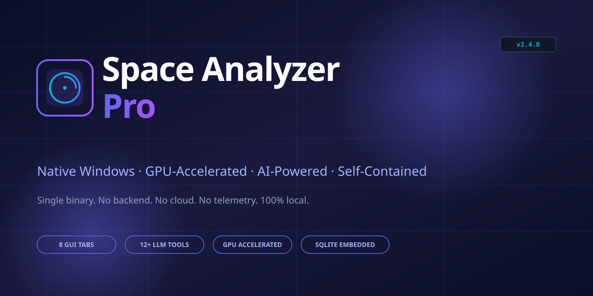
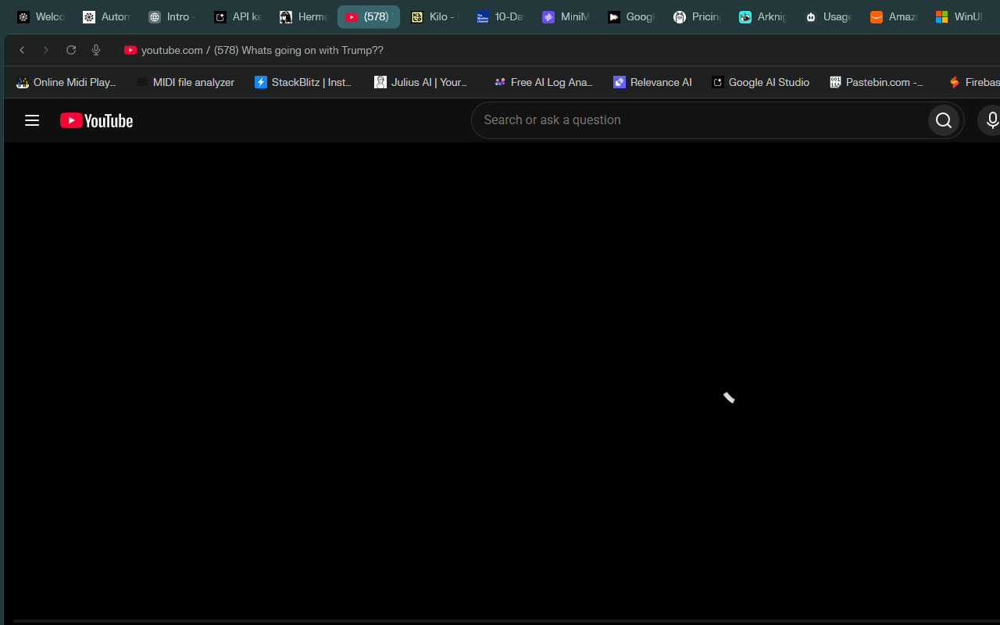
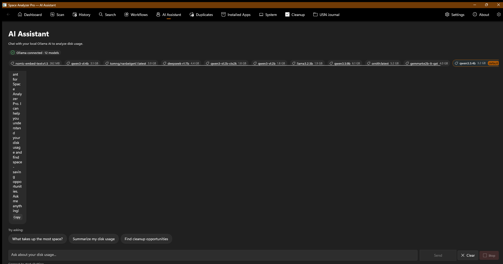

<p align="center">
  
</p>

<p align="center">
  
</p>

<p align="center">
  <a href="https://github.com/ogneocortext/space-analyzer-pro/releases/latest"></a>
  <a href="https://github.com/ogneocortext/space-analyzer-pro/blob/main/LICENSE"></a>
  <a href="https://github.com/ogneocortext/space-analyzer-pro/stargazers"></a>
</p>

<p align="center">
  <strong>Space Analyzer Pro</strong> is a native Windows disk-space analyzer with an optional local AI assistant and optional NVIDIA GPU acceleration. No cloud, no telemetry, no accounts — scan your drives, find bloat and duplicates, and reclaim space with a single ~16&nbsp;MB desktop app.
</p>

<p align="center">
  <a href="#why-space-analyzer-pro">Why?</a> &nbsp;·&nbsp;
  <a href="#quick-start">Quick Start</a> &nbsp;·&nbsp;
  <a href="#features">Features</a> &nbsp;·&nbsp;
  <a href="#architecture">Architecture</a> &nbsp;·&nbsp;
  <a href="#screenshots">Screenshots</a> &nbsp;·&nbsp;
  <a href="#development">Development</a> &nbsp;·&nbsp;
  <a href="#documentation">Docs</a>
</p>

<details>
<summary>For AI agents / automation working in this repo</summary>

> Primary issue tracker is **`docs/issues.json`** (schema v1, local-only / gitignored).
> Derived quick reference: **`docs/ISSUES.md`** (regenerate with `python docs/generate_status_summary.py --write`; gitignored). Do not use `docs/CONSOLIDATED_ISSUE_TRACKER.csv` as source of truth.
> Update workflow: find by `id:MAIN-XXX` tag in `tags[]` → fix code → update status in `issues.json` → `python docs/export_issues_to_csv.py`

</details>

---

## Why Space Analyzer Pro?

Space Analyzer Pro is available in one mode:

- **Desktop** — native Windows binary with direct filesystem access, embedded SQLite, optional GPU acceleration, and optional local LLM (Ollama). No servers, no ports, no telemetry.

| What you get | What you don't |
|---|---|
| Single ~16 MB desktop binary | No Node.js runtime required for desktop mode |
| Embedded SQLite database | No PostgreSQL, no Redis, no cloud DB |
| Optional local Ollama AI | No OpenAI API, no telemetry, no tracking |
| Optional NVIDIA GPU accel | No vendor lock-in, CPU fallback works fine |
| Recursive multi-volume scan | No browser limitations, no upload size limits |
| Hardlink-based dedup | No re-encoding, no data loss |

---

## Quick Start

The **active and only GUI is WinUI 3** (C# / .NET 10 / Windows App SDK 2.4.0).

### Get a prebuilt build (optional)

Prebuilt Windows builds are published on the [Releases](https://github.com/ogneocortext/space-analyzer-pro/releases/latest) page when available. **Note:** the newest features land on the `main` branch first, so a tagged release may lag behind — to run the latest code, build from source using the steps below.

> Runs on **Windows 10/11 x64**. Optional: install [Ollama](https://ollama.com) for the AI Assistant and Smart Search features; an NVIDIA GPU enables faster duplicate-hashing but is not required.

### WinUI 3 GUI (C#/.NET) — recommended

> **Note:** The WinUI 3 GUI requires Visual Studio 2022 MSBuild. `dotnet build` fails with WMC9999 on non-English Windows.

```powershell
# Build using Visual Studio MSBuild
& "D:\Microsoft Visual Studio\18\Community\MSBuild\Current\Bin\MSBuild.exe" gui-winui/SpaceAnalyzer.sln -p:Configuration=Debug -p:Platform=x64

# Run
dotnet run --project gui-winui/SpaceAnalyzer
```

> **Backend requirement:** The WinUI 3 GUI drives the Rust scanner as a subprocess
> (`space-analyzer-cli`). The `SpaceAnalyzer.csproj` build copies the two native
> tools from `<repo>/target/release` into the app output (and warns if they are
> missing). Build them first with `cargo build --release --bin space-analyzer-cli
> --bin node_modules_cleaner` at the repo root, or on demand with
> `dotnet build gui-winui/SpaceAnalyzer/SpaceAnalyzer.csproj /t:BuildRustScanner`.
> At runtime you can also point the app at prebuilt binaries via the
> `SPACE_ANALYZER_SCANNER` / `SPACE_ANALYZER_CLEANER` environment variables.

**WinUI 3 state (v4.2.0):**
- **Stable build** against Windows App SDK 2.4.0 / .NET 10
- **All 13 pages implemented and fully functional:** Dashboard, Scan, History, Smart Search, Workflows, AI Assistant, Duplicates, Installed Apps, System, Cleanup, USN Journal, Settings, About
- **Token-based design system** in `App.xaml` — spacing, typography, icon-size, card, button, and progress-bar resource dictionaries
- **Dashboard stat cards** with live system resource refresh and resource-history canvas charts
- **MVVM pattern** with `Helpers/`, `ViewModels/`, `Models/`, `Services/` separation
- **Ollama integration** via `OllamaClient.cs` with `JsonStringEnumConverter` for correct `ChatRole` serialization
- **Scan page:** scan-depth ComboBox (Quick/Default/Deep/Custom) with custom-depth slider, live filename streaming, Stop scan, path validation, scan errors display, file type distribution chart, largest files with filter, export results
- **AppLog diagnostics** — file logger at `%LOCALAPPDATA%/SpaceAnalyzer/ui-actions.log` with NAV/PAGE/ACTION/ERROR categories

### Prerequisites

| Requirement | Required? | Notes |
|---|---|---|
| **Rust 1.95+** | ✅ Yes | [rustup.rs](https://rustup.rs) |
| **Windows 10/11 x64** | ✅ Yes | Uses Win32 APIs in `native/win-usn/` |
| **NVIDIA GPU** | ⚠️ Optional | For GPU-accelerated dedup; CPU fallback works |
| **Ollama** | ⚠️ Optional | For AI Assistant and Smart Search tabs |

### Command Line Interface

The CLI uses subcommands for structured JSON output (used by the WinUI 3 GUI):

```bash
# Basic scan
cargo run --bin space-analyzer-cli -- scan --path . --verbose

# Export results to JSON
cargo run --bin space-analyzer-cli -- scan --path . --export results.json

# Deep scan with extended metadata
cargo run --bin space-analyzer-cli -- scan --path . --deep

# Show disk space info — prints a JSON array of every mounted volume
# (the --path arg is accepted but ignored in JSON output)
cargo run --bin space-analyzer-cli -- disk-info --format json
# Example: [{"mount_point":"C:\\","label":"SSD","file_system":"NTFS",
#   "total_bytes":...,"used_bytes":...,"available_bytes":...,"usage_percent":64.6}]

# Show scan history as an aligned headless table (default), with Safe/Caution/Keep
# reclaim tiers, duplicate badges (×N), and a pagination footer
cargo run --bin space-analyzer-cli -- history --limit 10

# Machine-readable history for the GUI / scripts (json, jsonl, csv, md also supported)
cargo run --bin space-analyzer-cli -- history --limit 10 --format json

# Run duplicate-file analysis
cargo run --bin space-analyzer-cli -- dedup --path .

# Inventory installed apps across drives / package managers
cargo run --bin space-analyzer-cli -- app-inventory --format json

# Lexical file search (extension / keyword / keyword + size + hidden)
cargo run --bin space-analyzer-cli -- search --path . --extension rs --limit 20

# Semantic (embeddings) search — requires Ollama
cargo run --bin space-analyzer-cli -- semantic-search --path . --query "tax documents"

# Free-form question about a saved scan (read-only agentic loop)
cargo run --bin space-analyzer-cli -- ask "what is using the most space?"

# Read/write settings
cargo run --bin space-analyzer-cli -- settings get

# Inspect the embedded database
cargo run --bin space-analyzer-cli -- db info

# Enumerate the NTFS USN journal for a volume
cargo run --bin space-analyzer-cli -- usn --drive C

# Global flags (apply to all subcommands)
--format {text,json,csv,jsonl,md}  Output format (default: text)
--top N                            Number of top items (default: 20)
--no-animation                     Suppress animations
```

---

## Features

### Core Scanning
- **Recursive directory scanning** with real-time progress, cancellation, and performance metrics
- **Multi-volume disk support** (3+ drives) with usage gauges
- **NTFS USN Journal scanner** for incremental change tracking
- **Hard-link detection** via MFT parsing
- **Scan history** with comparison, filtering, and SQLite-backed persistence
- **Path validation** before scan starts — invalid paths are rejected with a clear message
- **Scan cancellation** — Stop button kills the scanner process tree immediately
- **Scan errors** — per-scan error list displayed in the results panel
- **File type distribution** — top 10 extensions with percentage breakdown
- **Largest files** with live filter by filename substring
- **Export results** to JSON file from the scan page
- **Deep/shallow/custom depth** scan modes

### Analysis
- **File categorization** into 12 human-readable groups (Documents, Images, Videos, Audio, Archives, Code, Development, Config, Logs, Backups, Database, Other) — [`src/category.rs`](src/category.rs)
- **Bloat detection** via heuristic pattern classifier (large videos, cache files, build artifacts, dev dependencies) — [`src/offline_ai.rs`](src/offline_ai.rs)
- **Reclaimability lens** — every scanned file is classified into **Safe** (cache, temp, downloads, recycle-bin, build artifacts, logs), **Caution** (archives, backups, installers, old large media), or **Keep** (documents, photos, videos, code, user data); the History views show a per-tier reclaimable breakdown with a reclaimable %, and the "Other" bucket is decomposed into its top extensions
- **Storage trend prediction** based on historical scan data
- **AI recommendations** for cleanup, organization, and optimization
- **Largest files & directories** ranking

### File Management
- **Duplicate finder** with parallel hashing and **optional GPU acceleration**
- **Hard-link deduplication** to reclaim space without re-encoding
- **Destructive-action preview** — `DependencyReport` shows related files (hardlinks, symlinks, siblings, paired extensions) before deletion — [`src/file_relations.rs`](src/file_relations.rs)
- **Export** to JSON, CSV, HTML, and PDF

### AI Integration (Optional)
- **Ollama-powered AI Assistant** with chat, streaming, and tool-calling
- **Smart Search** using semantic embeddings for natural-language file queries
- **15+ tool registry** exposing scan/history/volumes/resources/storage_trend/workflows/file_type_breakdown/predict/patterns/search/largest_files/dependencies/stop_scan/export_results/classify_file/get_bloat_findings/get_recommendations/semantic_search to the LLM
- **Dynamic tool choice** — the assistant resolves which tools to call based on the user's message content, mirroring the Rust backend's `resolve_tool_choice` logic
- **Enriched ChatRequest** — `Options`, `Think`, and `KeepAlive` fields supported for fine-grained model control
- **100% local** — no cloud APIs, no telemetry

### Workflow Automation
- **5 workflow categories**: Maintenance, Optimization, Organization, Monitoring, Custom
- **4 trigger types**: Manual, LowDiskSpace, FileSystemChange, OnStartup
- **7 action types**: Scan, FindDuplicates, PredictStorage, GenerateRecommendations, Export, Notify, AIAnalyze
- **Pre-configured templates** for common cleanup tasks
- **Execution history** with status tracking and cancellation

### System Monitoring
- **CPU, RAM, GPU, and disk** real-time gauges
- **Per-volume usage** with free/total breakdowns
- **Storage trend** line chart (when ≥2 scans in history)
- **Background refresh** without UI blocking

---

## Architecture

The GUI is **WinUI 3** (`gui-winui/`, C# + Windows App SDK 2.4.0), the actively developed frontend.

| GUI | Path | Stack | Status |
|-----|------|-------|--------|
| **WinUI 3** | `gui-winui/` | C# + Windows App SDK 2.4.0 | Active development |

The core Rust library (`src/`) provides the database, Ollama integration, system monitoring, and CLI. WinUI 3 consumes this library via subprocess calls to the CLI.

### Tabs

| Tab | Purpose |
|-----|---------|
| **Dashboard** | Hero stats, file categories, bloat candidates, disk volumes, system resources, storage trend, AI recommendations |
| **Scan** | Configure paths, run scans, watch progress, view results |
| **History** | Browse past scans, compare, delete, export |
| **Smart Search** | Semantic search via local embeddings (requires Ollama) |
| **Workflows** | Create, edit, schedule, and run automated cleanup/analysis workflows |
| **AI Assistant** | Chat with local LLM; the LLM can call tools to scan, analyze, and act on your behalf |
| **Duplicates** | Find and remove duplicate files with parallel hashing |
| **System** | CPU/RAM/GPU/disk monitor with real-time gauges |
| **Cleanup** | Analyze and clean node_modules directories to reclaim disk space |
| **About** | Version, license, and core technologies |
| **Settings** | Configure Ollama endpoint, default scan paths, theme, GPU toggle |

### Stack

| Component | Implementation | Notes |
|---|---|---|
| **GUI (WinUI 3)** | Windows App SDK 2.4.0 (C#/.NET 10) | Fluent Design, Mica backdrop, 13 pages |
| **Database** | SQLite via `rusqlite` (bundled) | No external DB server |
| **File Scanner** | `scan-engine` (rayon-parallel) | CPU mode default |
| **GPU Acceleration** | `gpu-compute` crate (optional) | Auto-detects NVIDIA, falls back to CPU |
| **AI Backend** | Ollama (HTTP, local-only) | Off by default; opt-in via Settings |
| **Workflow Engine** | `src/workflows/` | Native Rust, no external scheduler |
| **System Monitor** | `sysinfo` crate | Cross-platform base + Windows-specific NTFS APIs |

---

## Screenshots

The **WinUI 3** frontend (Fluent Design, Windows App SDK) is the actively developed GUI — the capture below is from the real app.

| WinUI 3 — Dashboard | WinUI 3 — AI Assistant |
|---|---|
|  |  |

_To regenerate screenshots, run `just test-gui`, which uses the Win32 PrintWindow API to capture the actual GUI window._

---

## Development

### Build & Test

```bash
just build         # Build debug workspace
just build-release # Build optimized release
just test          # Run all tests
just verify        # Format check + clippy + tests
just run-gui       # Start the GUI
just run-cli       # Run the CLI scanner
just clippy        # Run lints only
just fmt           # Format all code
just package       # Build release + create distributable zip
just help          # Show all commands
```

### Project Structure

```
  src/                       # Core Rust library (no GUI)
   main.rs                  # CLI entry point
   lib.rs                   # Library exports
    cli/                     # CLI module (subcommands: scan, disk-info, history, dedup, app-inventory, search, semantic-search, ask, settings, db, usn)
     args.rs                # Clap subcommand definitions
     mod.rs                 # Subcommand dispatch
     scan.rs                # Directory scanning logic
     dedup.rs               # Duplicate analysis logic
     helpers.rs             # Shared helpers (get_disk_info, parse_size)
     types.rs               # Shared types (DiskInfo)
   ollama/                  # Ollama LLM client (chat, embeddings, streaming, tool calls)
  database/                # SQLite layer (scans, embeddings, settings, workflows)
  workflows/               # Analysis workflow engine (5 categories, 7 actions, 4 triggers)
   tool_registry/           # 15+ tools exposed to the LLM
  category.rs              # File extension → 12-category mapping
  offline_ai.rs            # Heuristic bloat pattern classifier
  file_relations.rs        # Dependency report (hardlinks, symlinks, siblings)
  system_monitor.rs        # CPU/RAM/GPU/disk monitoring
  embedding_service.rs     # Semantic search via Ollama embeddings
  disk_monitor.rs          # Background disk space monitor
  gui_common.rs            # Shared types for GUI implementations

gui-winui/                 # WinUI 3 desktop GUI (active development)
  SpaceAnalyzer.sln        # Visual Studio solution
  SpaceAnalyzer/
    SpaceAnalyzer.csproj   # .NET 10 + Windows App SDK 2.4.0
    App.xaml(.cs)          # Application entry
    MainWindow.xaml(.cs)   # NavigationView shell
    Views/                 # XAML pages (Dashboard, Scan, Settings, etc.)
    ViewModels/            # MVVM view models
     Services/
       ScannerService.cs    # Rust CLI interop (subprocess + JSON)
       ToolExecutor.cs      # AI tool-call execution (scan, dedup, history, disk-info)
    Models/                # Data models
    Assets/                # Icons, images

native/                    # Standalone Rust binaries
  win-usn/                 # Windows NTFS scanner (USN Journal, MFT, hardlinks)
  file_deduplicator/       # GPU-accelerated duplicate file finder
  node_modules_cleaner/    # Node.js dev-dependency cleanup tool

scan-engine/            # Shared scanning logic (used by GUI + CLI + dedup)
gpu-compute/               # Optional CUDA kernels (parallel hashing, dedup)

assets/                    # Visual assets
  banner/                  # Social preview (1280×640 PNG + SVG)
  icon/                    # App icon (multi-resolution .ico + 6 PNG sizes)
  diagrams/                # Mermaid source (architecture.md, workflow.md)
  screenshots/             # GUI captures (design/ for prototypes, docs/ for real app)

docs/                      # Documentation
  architecture/            # Design decisions, diagrams, project structure
  development/             # Setup, testing, database migration guides
  ai/                      # Ollama setup, ML integration, benchmarks
  guides/                  # User guides (troubleshooting, native builds, GPU fixes)
  performance/             # Performance docs
  implementations/         # Security, localhost tools, clean.md

tests/unit/                # Rust unit + integration tests
scripts/                   # Python/PowerShell utility scripts (test/, debug/, utility/)
config/                    # Tool configuration (non-secret)
```

### Code Conventions

- `rustfmt` + `clippy -D warnings` enforced via `just verify`
- `thiserror` for library error types, `anyhow` for application errors
- `///` doc comments on all public items
- Workspace dependencies in root `Cargo.toml`; member crates pin versions from there

---

## Documentation

- [Architecture Decisions](docs/ARCHITECTURE_DECISIONS.md) — key decisions + on-hold rules (read before automation/cleanup)
- [Data Flow](docs/DATA_FLOW.md) — subsystem map + file locator
- [AI Integration](docs/ai/) — Ollama setup, embeddings, ML integration, benchmarks
- [Guides](docs/guides/) — troubleshooting, native builds, GPU fixes
- [Changelog](docs/CHANGELOG.md) — release notes (current state in `docs/changelog/unreleased.md`)
- [Security](SECURITY.md) — local-first security model
- [Contributing](CONTRIBUTING.md) — how to contribute

---

## Versioning

The Rust core (`src/`, root `Cargo.toml`) and the WinUI 3 frontend (`gui-winui/`) are versioned **independently** but released in lockstep — both are currently **`4.2.0`**. They are designed to work as a combined system, but each can also be used on its own — the Rust core as a library/CLI, and the WinUI 3 app via subprocess calls to that CLI.

**v4.2.0** — See [CHANGELOG.md](docs/CHANGELOG.md) for full release notes.
- Reclaimability lens (Safe / Caution / Keep tiers) + persistent reclaim columns; `potential_cleanup_bytes` now returns Safe + Caution.
- Headless `history` table renderer (`--format text`) with ANSI tier colors, duplicate badges, and a pagination footer.
- WinUI 3 reclaim UI, "Other" bucket decomposition, scan-crash fix, and hardened logging.
- Agentic Assistant: `search` streaming progress, `semantic_search` tool, duplicate tool-call guard, token streaming.

**v3.7.0** — See [CHANGELOG.md](docs/CHANGELOG.md) for full release notes.

- **v3.x** — Rust desktop application (active development)
- **v2.x and earlier** — Web-based Vue 3 + Node.js implementation (archived at [space-analyzer-pro-web](https://github.com/ogneocortext/space-analyzer-pro-web))

---

## License

MIT — see [LICENSE](LICENSE) for details.


