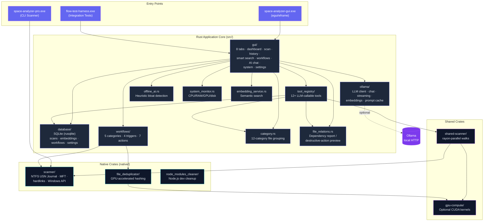

```mermaid
graph TB
    subgraph Entry["Entry Points"]
        GUI["space-analyzer-gui.exe<br/>(egui/eframe)"]
        CLI["space-analyzer-pro.exe<br/>(CLI Scanner)"]
        FTH["flow-test-harness.exe<br/>(Integration Tests)"]
    end

    subgraph App["Rust Application Core (src/)"]
        direction TB
        Gui["gui/<br/>8 tabs · dashboard · scan · history ·<br/>smart search · workflows · AI chat ·<br/>system · settings"]
        Ollama["ollama/<br/>LLM client · chat · streaming ·<br/>embeddings · prompt cache"]
        DB["database/<br/>SQLite (rusqlite)<br/>scans · embeddings · workflows · settings"]
        WF["workflows/<br/>5 categories · 4 triggers · 7 actions"]
        TR["tool_registry/<br/>12+ LLM-callable tools"]
        Cat["category.rs<br/>12-category file grouping"]
        OAI["offline_ai.rs<br/>Heuristic bloat detection"]
        FR["file_relations.rs<br/>Dependency report /<br/>destructive-action preview"]
        SM["system_monitor.rs<br/>CPU/RAM/GPU/disk"]
        ES["embedding_service.rs<br/>Semantic search"]
    end

    subgraph Native["Native Crates (native/)"]
        Scanner["scanner/<br/>NTFS USN Journal · MFT ·<br/>hardlinks · Windows API"]
        Dedup["file_deduplicator/<br/>GPU-accelerated hashing"]
        NMC["node_modules_cleaner/<br/>Node.js dev cleanup"]
    end

    subgraph Shared["Shared Crates"]
        SS["shared-scanner/<br/>rayon-parallel walks"]
        GPU["gpu-compute/<br/>Optional CUDA kernels"]
    end

    GUI --> Gui
    CLI --> Scanner
    FTH --> Gui
    Gui --> Cat
    Gui --> OAI
    Gui --> FR
    Gui --> ES
    Gui --> SM
    Gui --> WF
    Gui --> Ollama
    Gui --> TR
    Gui --> DB
    Ollama -.optional.-> OllamaExt[(Ollama<br/>local HTTP)]
    TR --> Cat
    TR --> FR
    TR --> SS
    TR --> DB
    WF --> Scanner
    WF --> Dedup
    SS --> GPU
    SS --> Scanner
    Dedup --> GPU

    classDef entry fill:#6366f1,stroke:#a855f7,color:#fff
    classDef app fill:#1e293b,stroke:#6366f1,color:#e2e8f0
    classDef native fill:#0f172a,stroke:#06b6d4,color:#e2e8f0
    classDef shared fill:#0f172a,stroke:#a855f7,color:#e2e8f0
    classDef ext fill:#7c3aed,stroke:#a855f7,color:#fff

    class GUI,CLI,FTH entry
    class Gui,Ollama,DB,WF,TR,Cat,OAI,FR,SM,ES app
    class Scanner,Dedup,NMC native
    class SS,GPU shared
    class OllamaExt ext
```
