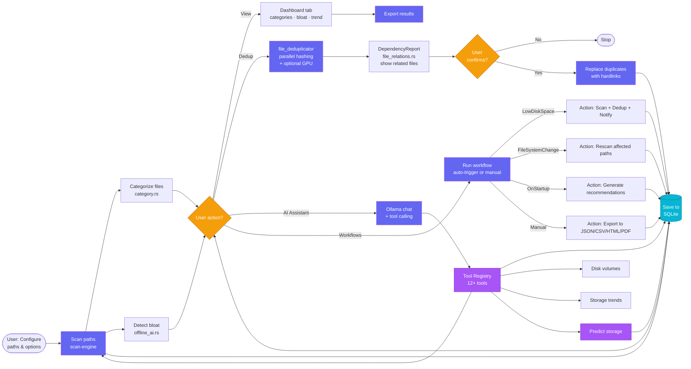

```mermaid
flowchart LR
    Start([User: Configure<br/>paths & options]) --> Scan[Scan paths<br/>scan-engine]
    Scan --> Cat[Categorize files<br/>category.rs]
    Scan --> Bloat[Detect bloat<br/>offline_ai.rs]
    Scan --> History[(Save to<br/>SQLite)]
    Cat --> Analyze{User action?}
    Bloat --> Analyze
    History --> Analyze

    Analyze -->|View| Dashboard[Dashboard tab<br/>categories · bloat · trend]
    Analyze -->|Dedup| FindDup[file_deduplicator<br/>parallel hashing<br/>+ optional GPU]
    FindDup --> Preview[DependencyReport<br/>file_relations.rs<br/>show related files]
    Preview --> Confirm{User<br/>confirms?}
    Confirm -->|No| Stop([Stop])
    Confirm -->|Yes| Hardlink[Replace duplicates<br/>with hardlinks]
    Hardlink --> History

    Analyze -->|AI Assistant| Chat[Ollama chat<br/>+ tool calling]
    Chat --> Tools[Tool Registry<br/>12+ tools]
    Tools --> Scan
    Tools --> History
    Tools --> Volumes[Disk volumes]
    Tools --> Trends[Storage trends]
    Tools --> Pred[Predict storage]

    Analyze -->|Workflows| WF[Run workflow<br/>auto-trigger or manual]
    WF -->|LowDiskSpace| Action1[Action: Scan + Dedup + Notify]
    WF -->|FileSystemChange| Action2[Action: Rescan affected paths]
    WF -->|OnStartup| Action3[Action: Generate recommendations]
    WF -->|Manual| Action4[Action: Export to JSON/CSV/HTML/PDF]

    Dashboard --> Export[Export results]
    Action1 --> History
    Action2 --> History
    Action3 --> History
    Action4 --> History
    Pred --> History

    classDef action fill:#6366f1,stroke:#a855f7,color:#fff
    classDef storage fill:#06b6d4,stroke:#0e7490,color:#fff
    classDef decision fill:#f59e0b,stroke:#b45309,color:#fff
    classDef ai fill:#a855f7,stroke:#7e22ce,color:#fff

    class Scan,FindDup,Hardlink,Chat,WF,Export action
    class History storage
    class Analyze,Confirm decision
    class Tools,Pred ai
```
