# Architecture Diagrams

> Auto-generated from the codebase — update when the architecture changes.

## 1. Workspace Crate Dependency Graph

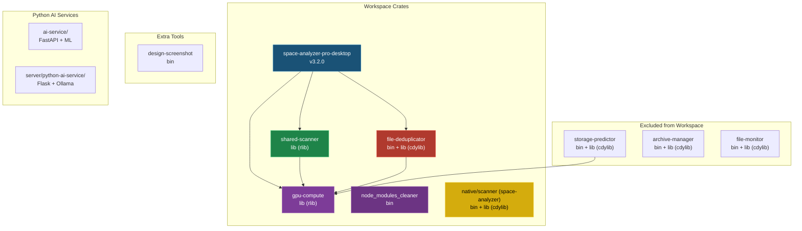

## 2. Binary Targets

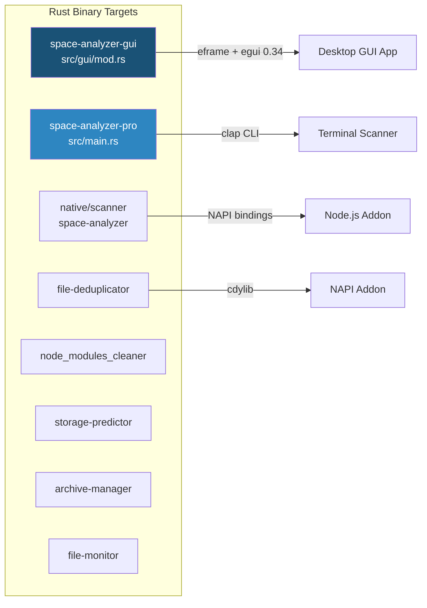

## 3. GUI Module Hierarchy

```mermaid
graph TB
    subgraph level0["Crate Root — src/gui/mod.rs"]
        main["fn main()<br/>eframe::run_native"]
        app["SpaceAnalyzerApp<br/>struct + impl Default + impl App"]
        icons["mod icons<br/>(inline)"]
    end

    subgraph level1["Sibling Modules (use super::*)"]
        scan["mod scan<br/>start_scan, render_scan"]
        dashboard["mod dashboard<br/>dashboard UI + trend chart"]
        history["mod history<br/>history list UI"]
        settings["mod settings<br/>settings UI + save"]
        system["mod system<br/>system info UI"]
        workflow_render["mod workflow_render<br/>workflow editor + actions"]
        embeddings["mod embeddings<br/>smart search UI + indexing"]
        dedup["mod dedup<br/>dedup UI + SimpleDeduplicator"]
    end

    subgraph level2["AI Sub-modules (use super::super::*)"]
        ai_mod["ai/mod.rs"]
        chat["ai/chat.rs<br/>send_chat, process_ollama"]
        rendering["ai/rendering.rs<br/>chat bubble UI"]
        quick_actions["ai/quick_actions.rs<br/>quick action buttons"]
        model_discovery["ai/model_discovery.rs<br/>model listing + selection"]
        ollama_mgmt["ai/ollama.rs<br/>process management"]
    end

    subgraph external["External Modules (crate-level)"]
        database["database/mod.rs<br/>Database, AppSettings"]
        ollama["ollama/mod.rs<br/>OllamaClient, PromptCache"]
        tool_registry["tool_registry/mod.rs<br/>ToolRegistry"]
        workflows["workflows/mod.rs<br/>Workflow, WorkflowAction"]
        embedding_service["embedding_service.rs<br/>embed_files, search_files"]
        gui_common["gui_common.rs<br/>ScanResult, formatting"]
        system_monitor["system_monitor.rs<br/>DiskVolume, GpuInfo"]
        session_logger["session_logger.rs<br/>SessionLogger"]
        utils["utils.rs<br/>sanitize_error_message"]
    end

    app --> dashboard
    app --> scan
    app --> history
    app --> embeddings
    app --> dedup
    app --> workflow_render
    app --> system
    app --> settings
    app --> ai_mod
    app -.-> database
    app -.-> ollama
    app -.-> tool_registry
    app -.-> workflows
    app -.-> embedding_service
    app -.-> gui_common
    app -.-> system_monitor
    app -.-> session_logger
    app -.-> utils

    ai_mod --> chat
    ai_mod --> rendering
    ai_mod --> quick_actions
    ai_mod --> model_discovery
    ai_mod --> ollama_mgmt

    style level0 fill:#1a5276,color:#fff
    style level1 fill:#2e86c1,color:#fff
    style level2 fill:#7d3c98,color:#fff,stroke:#af7ac5
    style external fill:#1e8449,color:#fff,stroke:#58d68d
```

## 4. Ollama Module Tree

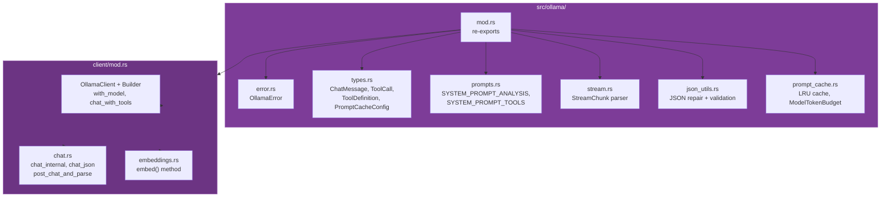

## 5. Database Schema

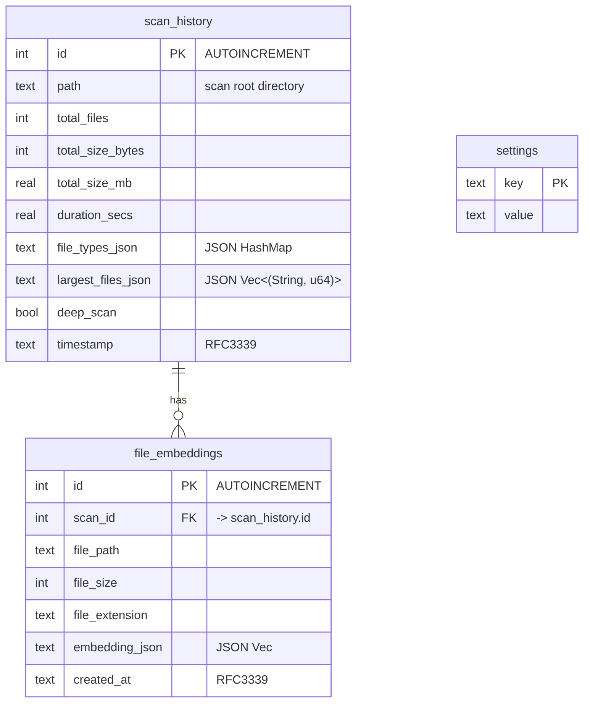

## 6. Scan Data Flow

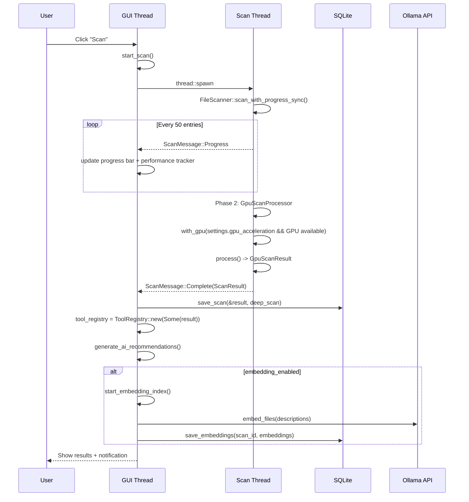

## 7. AI Chat & Tool Calling Flow

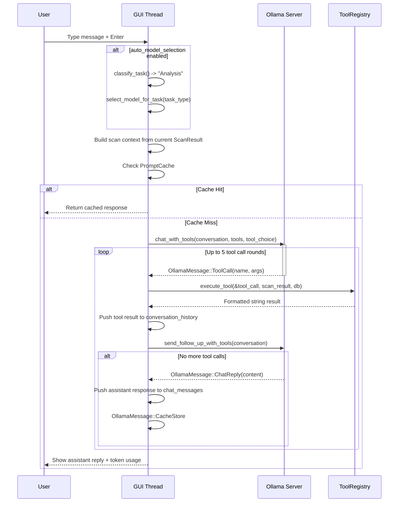

## 8. Settings Architecture

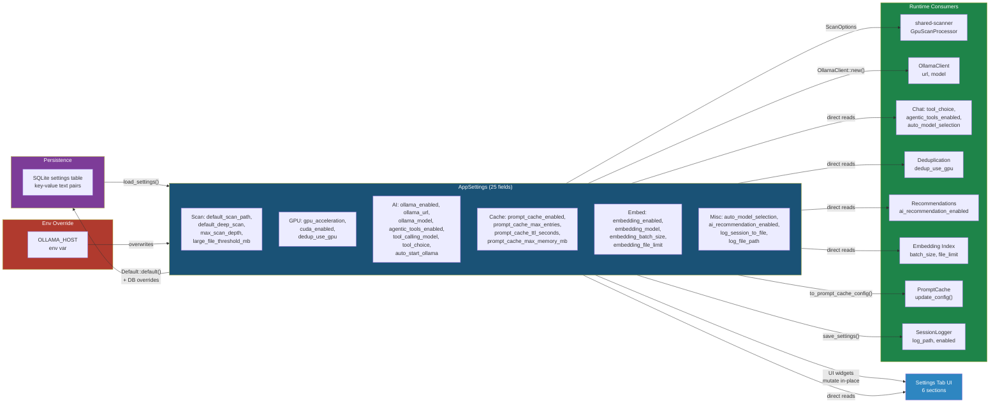

## 9. App Event Loop (per frame)

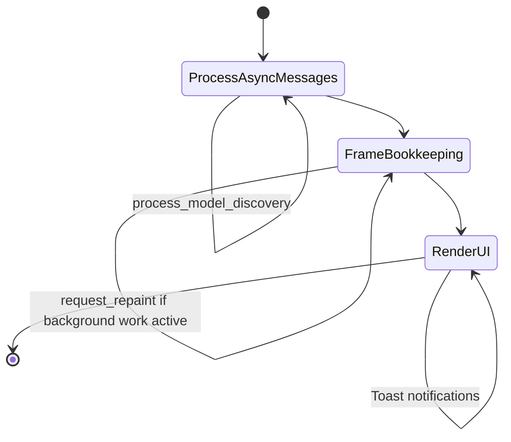

## 10. Workflow System

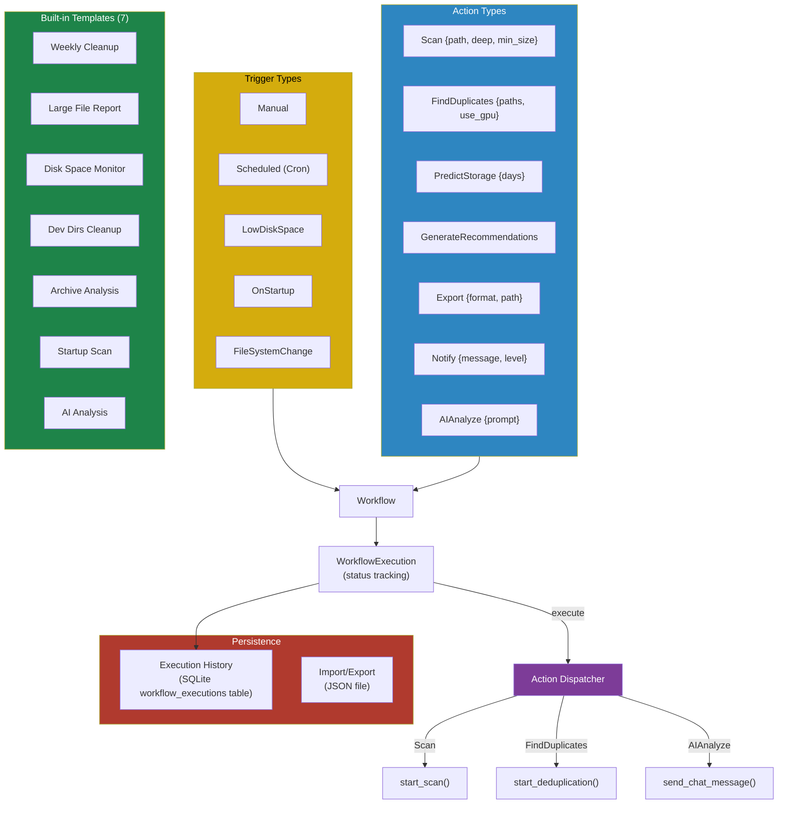

## 11. GPU Compute Architecture

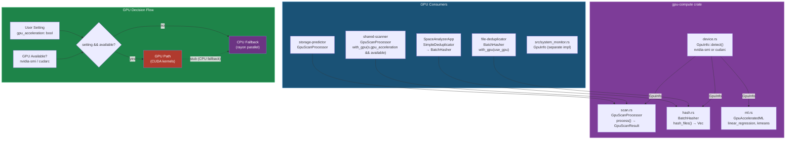

## 12. Key Struct Relationships

```mermaid
classDiagram
    class SpaceAnalyzerApp {
        +AppTab active_tab
        +PathBuf current_path
        +Option~ScanResult~ scan_result
        +AppSettings settings
        +Vec~ChatMessage~ chat_messages
        +Vec~OllamaChatMessage~ conversation_history
        +Option~OllamaClient~ ollama_client
        +Option~Database~ db
        +Option~ToolRegistry~ tool_registry
        +PromptCache prompt_cache
        +Vec~Workflow~ workflows
        +Vec~Notification~ notifications
        +SessionLogger session_logger
        +Vec~OllamaModelInfo~ discovered_models
        +String ai_recommendation_source
        +bool ai_recommendation_pending
        +Vec~SearchResult~ search_results
        +Vec~(String,u64,String,Vec~f32~)~ cached_embeddings
        +ScanPerformanceTracker scan_performance
    }

    class AppSettings {
        +String default_scan_path
        +bool default_deep_scan
        +u32 max_scan_depth
        +u64 large_file_threshold_mb
        +bool gpu_acceleration
        +bool cuda_enabled
        +bool dedup_use_gpu
        +bool ollama_enabled
        +String ollama_url
        +String ollama_model
        +bool agentic_tools_enabled
        +String tool_calling_model
        +String tool_choice
        +bool auto_start_ollama
        +bool prompt_cache_enabled
        +usize prompt_cache_max_entries
        +u64 prompt_cache_ttl_seconds
        +usize prompt_cache_max_memory_mb
        +bool embedding_enabled
        +String embedding_model
        +usize embedding_batch_size
        +usize embedding_file_limit
        +bool auto_model_selection
        +bool ai_recommendation_enabled
        +bool log_session_to_file
        +String log_file_path
    }

    class ScanResult {
        +u64 total_files
        +u64 total_size_bytes
        +f64 total_size_mb
        +f64 duration_secs
        +HashMap~String,u64~ file_types
        +Vec~(String,u64)~ largest_files
        +String path
    }

    class Database {
        +Connection conn
        +load_settings() AppSettings
        +save_all_settings()
        +save_scan()
        +get_scan_history()
        +save_embeddings()
        +save_workflow_execution()
        +get_workflow_history()
    }

    class OllamaClient {
        -String base_url
        -String model
        +chat_with_tools()
        +embed()
        +with_model()
    }

    class ChatMessage {
        +String role
        +String content
        +Option~ToolResultDisplay~ tool_result
    }

    class Workflow {
        +String id
        +String name
        +String description
        +WorkflowTrigger trigger
        +Vec~WorkflowAction~ actions
        +bool enabled
    }

    SpaceAnalyzerApp *-- AppSettings : settings
    SpaceAnalyzerApp o-- ChatMessage : chat_messages
    SpaceAnalyzerApp o-- Workflow : workflows
    SpaceAnalyzerApp o-- Database : db
    SpaceAnalyzerApp o-- OllamaClient : ollama_client
    SpaceAnalyzerApp o-- ScanResult : scan_result
    SpaceAnalyzerApp o-- ToolRegistry : tool_registry
    SpaceAnalyzerApp o-- PromptCache : prompt_cache

## 13. AI Recommendations Flow

```mermaid
flowchart TD
    trigger["Trigger: scan complete<br/>or GenerateRecommendations action"] --> dispatch{generate_ai_recommendations}

    dispatch --> check{"ai_recommendation_enabled<br/>&& ollama_available<br/>&& scan_result exists?"}

    check -->|no| heuristic["generate_storage_recommendations()<br/>StorageInsights::generate_recommendations<br/>(heuristic rules, instant)"]
    heuristic --> display["Store in ai_recommendations<br/>source = 'heuristic'"]

    check -->|yes| start["start_ai_recommendation()"]
    start --> pending["Set ai_recommendation_pending = true<br/>source = 'ai'"]
    pending --> thread["Spawn background thread"]
    thread --> async_fn["generate_ai_recommendations_async()"]

    async_fn --> build["Build system prompt + user prompt<br/>with scan file types + largest files"]
    build --> ollama["OllamaClient::chat_with_tools<br/>(prompts, no tools, tool_choice='none')"]

    ollama --> parse{"Parse response<br/>as Vec&lt;AIRecommendation&gt;"}
    parse -->|success| send_ai["Send (recs, is_ai=true)"]
    parse -->|fail| try_extract["try_extract_recommendations()"]
    try_extract -->|wrapped format| send_ai
    try_extract -->|fail| fallback["StorageInsights::generate_recommendations()"]
    fallback --> send_fallback["Send (recs, is_ai=false)"]
    ollama -->|error| fallback

    send_ai --> process["process_ai_recommendations()<br/>(update loop)"]
    send_fallback --> process
    process --> set_recs["Set ai_recommendations,<br/>ai_recommendation_source,<br/>ai_recommendation_pending = false"]

    set_recs --> display

    style trigger fill:#2e86c1,color:#fff
    style check fill:#d4ac0d,color:#000
    style heuristic fill:#1e8449,color:#fff
    style async_fn fill:#7d3c98,color:#fff
    style ollama fill:#7d3c98,color:#fff
    style fallback fill:#6c3483,color:#fff
    style display fill:#1a5276,color:#fff
```

## 14. Conversation History Trimming

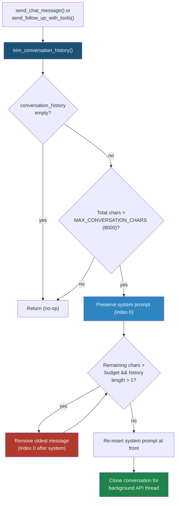
